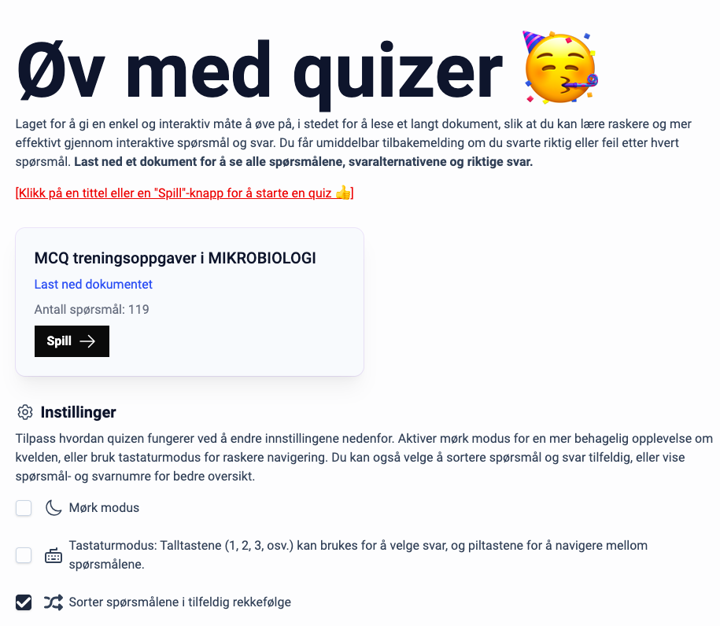

# Quiz

</img>


Dette prosjektet er laget for å gi en enkel og interaktiv måte å øve på quiz-oppgaver. Den støtter tilpasning, slik at brukere enkelt kan legge til sine egne quizzer ved å opprette en JSON-fil med spørsmål og svar. Dette gjør det til et fleksibelt verktøy for læring og underholdning.


## Kjør nettsiden

1. Klon repositoryet
```bash
git clone https://github.com/JonathanD01/zal-quiz-site.git
```

2. Kjør server
``` bash
cd zal-quiz-site
node app.js
```

3. Besøk siden
```
localhost:3000
```

## Legg til din egen quiz
Å legge til din egen quiz er ganske enkelt! Følg disse stegene for å integrere din egen quiz i systemet.

### 1) JSON-fil

Lag en ny JSON-fil og legg den i `/public/data`-mappen. Filen må følge den samme strukturen som vist under. Sørg for at spørsmålene og svarene er korrekt formattert.

```json
{
    "title": "MCQ treningsoppgaver i MIKROBIOLOGI",
    "document_url": "/docs/BSY161_oppgaver_cleaned_compressed.pdf",
    "questions": [
        {
            "question": "1. Hva er riktig påstand?",
            "answers": [
                {
                    "text": "a) Alle livsformer på jorda er bygget på grunnlag av den prokaryote cellen",
                    "correct": false
                },
                {
                    "text": "b) Alle bakterier er prokaryote",
                    "correct": true
                }
            ]
        },
        {
            "question": "2. Hva er riktig påstand om prokaryote og eukaryote celler?",
            "answers": [
                {
                    "text": "a) Det er ingen vesensforskjell på de to celletypene, kun i størrelse",
                    "correct": false
                },
                {
                    "text": "b) Begge har ekte kjerner, men bare den prokaryote cellen inneholder DNA",
                    "correct": false
                },
                {
                    "text": "c) Kun den eukaryote cellen inneholder en ekte kjerne",
                    "correct": true
                }
            ]
        }
    ]
}
```

**JSON-filstruktur**
- **title:** Tittel på quizzen.
- **document_url:** En lenke hvor selve quizen kan bli lastet ned (alle spørsmål og svar).
- **questions:** En liste med objekter som representerer spørsmålene i quizzen.
	- **question:** Selve spørsmålet som skal vises.
	- **answers:** En liste over svaralternativene til spørsmålet.
		- **text:** Teksten som vises for hvert svaralternativ.
		- **correct:** En boolsk verdi (true eller false) som indikerer om svaret er korrekt.

### 2) Legg til quiz i Javascript
Åpne `/public/scripts/scripts.js` hvor quizdata håndteres, og legg til den nye quizen i `QUIZ_DATA_MAP`. Dette kartet kobler en nøkkel til filstien til JSON-filen din.
```js
// QUIZ DATA
QUIZ_DATA_MAP = new Map(); // <- FINN DENNE LINJEN
QUIZ_DATA_MAP.set("my-key", '/data/my-json-file.json'); // <- LEGG TIL DENNE LINJEN
```

Bytt ut `"my-key"` med en unik nøkkel for quizzen din, og bytt ut `'/data/my-json-file.json'` med filstien til din JSON-fil.